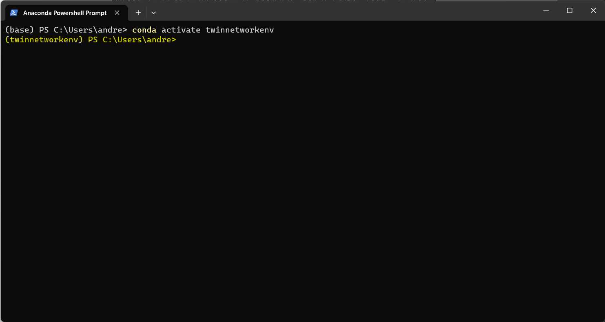
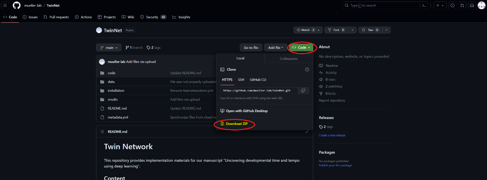
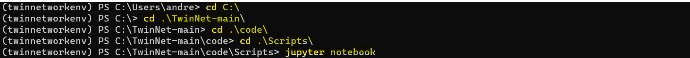
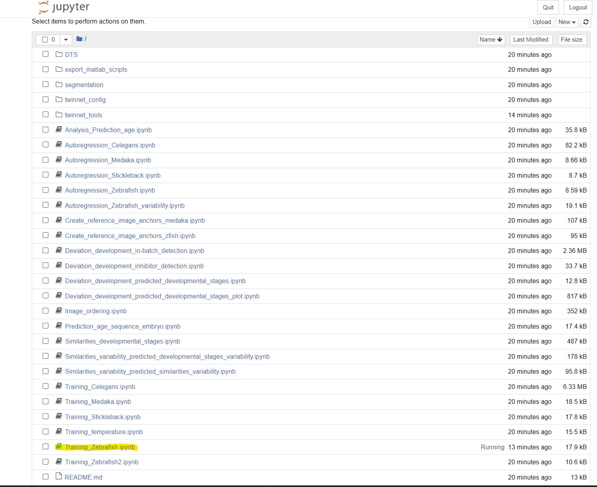
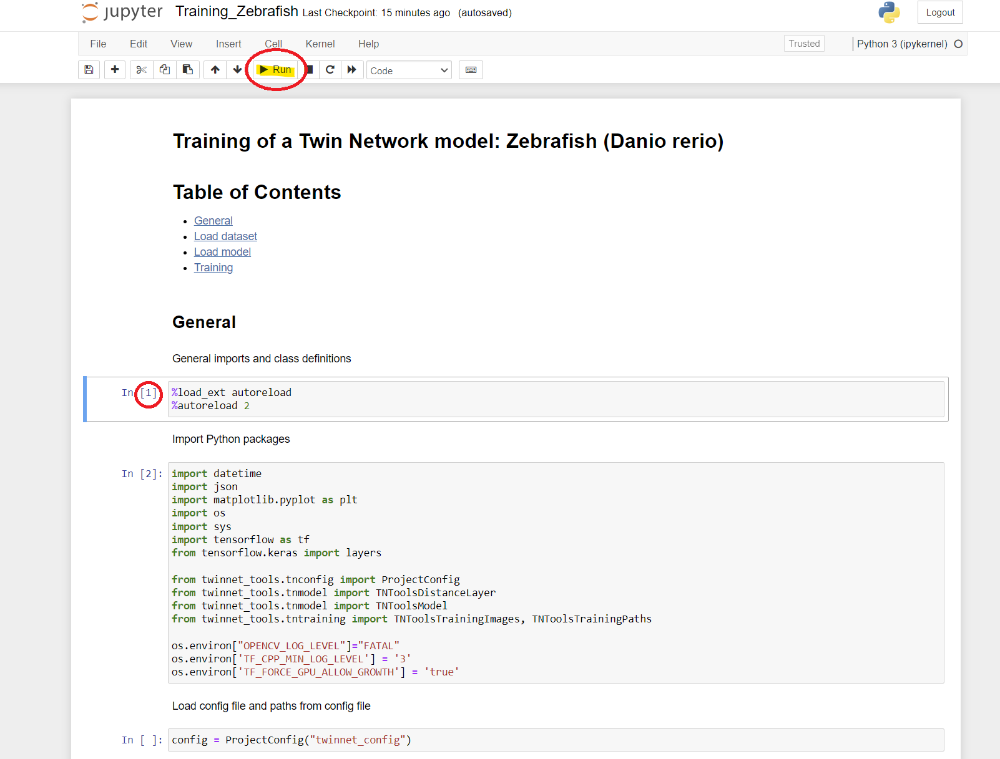
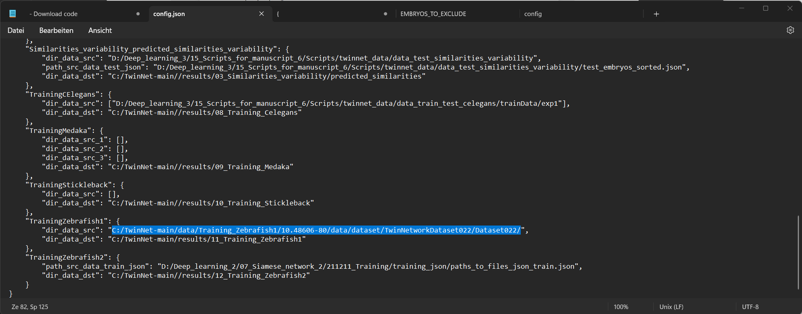
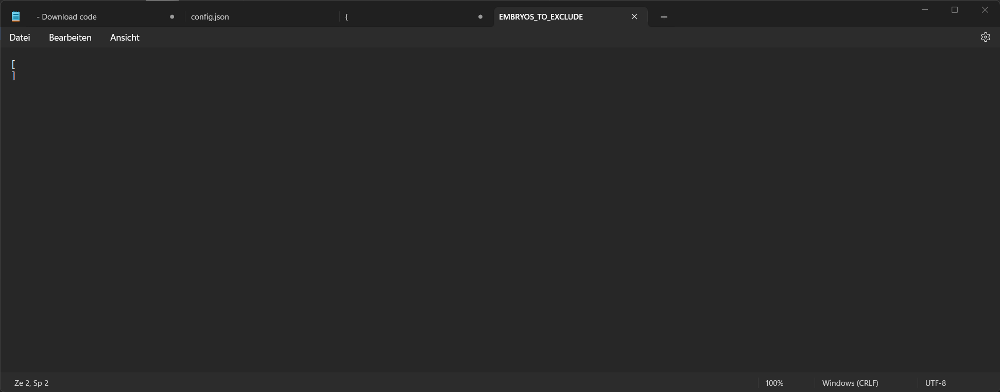
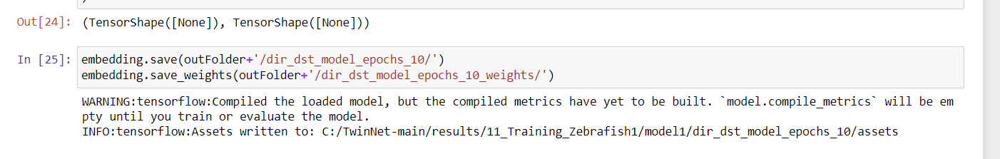
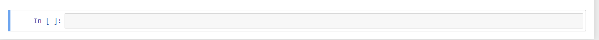

# Twin Network step-by-step tutorial
This an step-by-step tutorial to starte working with TwinNet in Windows10.

## Content
- [Installation](https://github.com/mueller-lab/TwinNet/tree/main/installation#installation)
- [Training TwinNet using zebrafish image data](https://github.com/mueller-lab/TwinNet/tree/main/installation#training-twinnet-using-zebrafish-image-data)
- [Test TwinNet using zebrafish image data](https://github.com/mueller-lab/TwinNet#installation-guide)
- [Problem solving in jupyter](https://github.com/mueller-lab/TwinNet#Demo)


# Installation
We will use [miniconda](https://docs.conda.io/en/latest/miniconda.html) to create a TwinNet enviroment
  1. Go to https://docs.conda.io/en/latest/miniconda.html and download the Miniconda version that works for your platform
     
  

  3. Download and install Miniconda
  4. To install TwinNet: Go to https://github.com/mueller-lab/TwinNet#installation-guide
  5. You will now have three options  
     - We recommend Option 1: Create Python environment from https://github.com/mueller-lab/TwinNet/blob/main/installation/twinnetworkenv.yml  
     - This manual will continue with Option 1
       

  6. Go to https://github.com/mueller-lab/TwinNet/blob/main/installation/twinnetworkenv.yml and download the raw file
  

  7. Open “Anaconda Powershell Prompt” and copy the “twinnetworkenv.yml” raw file into the folder shown in the Anaconda Powershell Prompt command window  
     In this case the file has to be copied into the folder “andre” in “C:\Users”
  

  9. Copy the command “conda env create -f twinnetworkenv.yml” into the Anaconda Powershell Prompt command window and run it by pressing enter  
      If you want to use your own dataset you need to make adjustments to a specific file called “config”. You can find the file under “C:\TwinNet-main\code\Scripts\twinnet_config\Windows”. In this file you have to change the source path from the training data set path to your dataset path.Packages are now automatically downloaded, extracted and TwinNet installed.
       
     - Typical installation time on a standard desktop computer with standard internet connection speeds is approximately 20 min.
     - When the installation is finished the initial command line is shown on the Anaconda Powershell Prompt
       

# Training TwinNet using zebrafish image data

1. Open the Anaconda Powershell Prompt command window and activate the environment by typing in “conda activate twinnetworkenv”. The environment should switch from (base) to (twinnetworkenv)
   
2. Go to https://github.com/mueller-lab/TwinNet#installation-guide and download the whole code
   
3. After the download, extract the zip file directly into C:\, by right clicking it “extract all” and again clicking “Extract” in the appearing window.
4. After extracting the file into C:\ you have to download a few more files. These files have to be placed into specific folders or sometimes replace existing folders.
- Go to https://cloud.uni-konstanz.de/index.php/s/mCWq75Eg5cXQPA4 and download all the data
- After the download, extract the zip file directly into C:\, by right clicking it “extract all”, choosing the path (C:\) and again clicking “Extract” in the appearing window.
- You now have a folder in C:\ called “TwinNet_TutorialData”, open it and move the three folders to the correct place with right click on the folder  cut and right click  paste in the destination folder
    * “data_test_similarities_developmental_stages” to “C:\TwinNet-main\data\twinnet_data\”
    * “image_jsons_reference” also to “C:\TwinNet-main\data\twinnet_data\” (replace the existing folder)
    * “tn_models_zebrafish” to “C:\TwinNet-main\data\twinnet_models\” (replace the existing folder)
       
5. Go to the Anaconda Powershell Prompt and execute five commands by typing in the yellow marked text and pressing enter (one after another)
 
6. After executing the last command your browser will open jupyter where you can find the training scripts. Select the script with which you want to train your network with by clicking on it. E.g. the zebrafish training script.

7. Go through the script step by step until “Load Dataset” by clicking on the boxes and then executing the code by clicking on “Run”. If a number appears in the square bracket next to the box without an error message, the code was successfully executed.  


8.After successfully executing the code in box 7, download the dataset from https://kondata.uni-konstanz.de/radar/en/dataset/HRaUYMZlKFdBJqNx. Before extracting the data you have to create a folder ”Training_Zebrafish1” in “C:\TwinNet-main\data\”. Into this newly created folder you have to extract the date to (in the same way you did before). 
- If you want to use your own dataset you need to make adjustments to a specific file called “config”. You can find the file under “C:\TwinNet-main\code\Scripts\twinnet_config\Windows”. In this file you have to change the source path from the training data set path to your dataset path.


9. After downloading the dataset to the folder you have to extract the data from the file. Open the command prompt and execute four commands by typing in the yellow marked text and pressing enter (one after another)


- When the extraction process is finished the initial command line is shown at the end of the command prompt (C:\TwinNet-main\data\Training_Zebrafish1>)

10. After the extraction, go to the folder C:\TwinNet-main\data\Training_Zebrafish1\10.48606-80\data\dataset, here you have to extract the files from the zip folder by using winrar

- Download WinRar on the following website for free https://www.win-rar.com/start.html?&L=0
- Right click on the zip folder and choose winrar to extract the files. This takes usually ~30 min
  
11. After extraction you need to create a .json file called „EMBRYOS_TO_EXCLUDE” under C:\TwinNet-main\data\Training_Zebrafish1\10.48606-80\data\dataset\TwinNetworkDataset022\Dataset022 or under your own dataset. 
- If the folder “TwinNetworkDataset022” does not exist under “dataset”, create it and put the “Dataset022” folder into it.
- Create the file by creating Text document (right click in the folder, “New” -> “Text Document”. Give the Text Document the name “EMBRYOS_TO_EXCLUDE”. Make sure that you see the file name extensions (If not go in the folder settings to ”View”, and tick the box “File Name extensions”. Change the File name extension from “.txt” to “.json” to create the .json file.
- Type in : "[]" if you do not want to exclude embryos from your analysis
- In this file you can also exclude data by typing in the file name. In case you don’t want to exclude data, you still need the file but in this case it is empty and should look like this for the script to work.
   

12. Then proceed with box 8 under “Load Dataset” in the notebook
13. After the dataset is loaded continue with “Load model” and “Training”
- The three steps under Training „Training iteration 1, 2 and 3“ will take its time
- Do also not worry about the following message
   

14. After you see the following you are finished with the training session.
 


# Installation Guide
We recommend creating an environment for the implementation of the code for Twin Network, for example using Miniconda (https://docs.conda.io/en/latest/miniconda.html).

A Python environment for TwinNet implementation can be created as follows:

*Option 1*: Create Python environment from [twinnetworkenv.yml](https://github.com/mueller-lab/TwinNet/blob/main/installation/twinnetworkenv.yml) file:
```
conda env create -f twinnetworkenv.yml
```

*Option 2*: Create Python environment from [requirements.txt](https://github.com/mueller-lab/TwinNet/blob/main/installation/requirements.txt) file:
```
conda create --name 'twinnet' --file requirements.txt
```

*Option 3*: Create environment manually
- Create a python environment with Python 3.9
- Install [Tensorflow](https://www.tensorflow.org/install/)
- Install other dependencies ([requirements.txt](https://github.com/mueller-lab/TwinNet/blob/main/installation/requirements.txt))

```
conda create -n 'twinnet' python=3.9 
conda activate twinnet

pip install jupyter
pip install matplotlib
pip install opencv-python
pip install pandas
pip install scikit-learn
pip install scipy
pip install seaborn
pip install tensorflow-addons
pip install tensorflow_io
...
```

Typical installation time on a standard desktop computer with standard internet connection speeds is approximately 20 min. For installation of CUDA and cuDNN, additional installation time of approximately 1 h and system reboots are required.

# Demo
To run the demo scripts for Twin Network on a local PC, please follow the [installation instructions](https://github.com/mueller-lab/TwinNet#installation-guide) to install Python with the required packages. The demo script access configuration files located in the [Scripts/twinnet_config](https://github.com/mueller-lab/TwinNet/tree/main/code/Scripts/twinnet_config) directory. Before running the scripts, update the corresponding data paths in the config files for Windows or Linux, depending on your operating system, with the required file paths.

A description of the scripts is given here: [Overview of scripts](https://github.com/mueller-lab/TwinNet/tree/main/code/Scripts/README.md). Training and testing files are located in the folder [Scripts](https://github.com/mueller-lab/TwinNet/tree/main/code/Scripts).

Run times depend on installed hardware, sample and batch sizes used for the analysis. Examples for approximate durations tested on our system:
- The duration of the generation of embeddings and the calculation of similarities for 1 test image and 1 reference image sequence with 720 frames is 18 s
- Calculation of embeddings and similarities for 1 test image sequence with 418 frames and 3 reference datasets with each 360 frames is 160 s
- Image ordering of a test image sequence with 300 frames is 20 s
- Calculation of similarities for each image of a test embryo with all previous images of the same embryo for an image sequence with 360 images is 5-10 s
- Calculation of similarity values between 77 embryos at 360 different acquisition timepoints is 11 min

# Results
Examples of results using the testing demo scripts are stored within the ["results"-directory](https://github.com/mueller-lab/TwinNet/tree/main/results).

# License
The content of this project is licensed under the the GNU General Public License version 3.0 (GPL-3.0).
