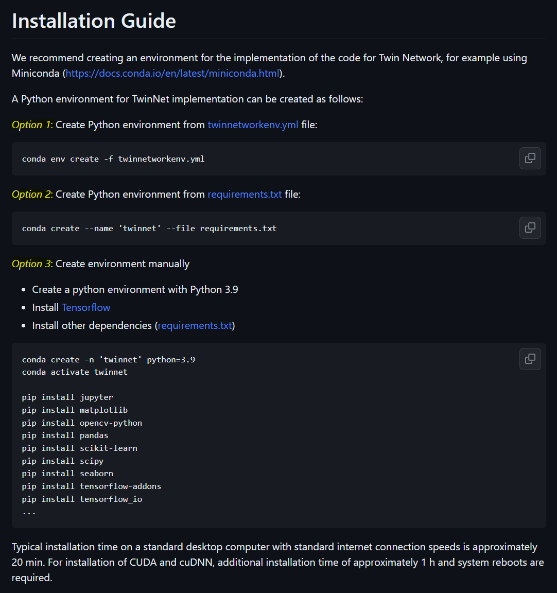

# Twin Network step-by-step tutorial
This an step-by-step tutorial to starte working with TwinNet in Windows10.

## Content
- [Installation](https://github.com/mueller-lab/TwinNet/tree/main/installation#installation)
- [Training TwinNet using zebrafish image data](https://github.com/mueller-lab/TwinNet/tree/main/installation#training-twinnet-using-zebrafish-image-data)
- [Test TwinNet using zebrafish image data](https://github.com/mueller-lab/TwinNet#installation-guide)
- [Problem solving in jupyter](https://github.com/mueller-lab/TwinNet#Demo)


# Installation
We will use miniconda to create a TwinNet enviroment
  1. Go to https://docs.conda.io/en/latest/miniconda.html and download the Miniconda version that works for your platform
     
  

  3. Download and install Miniconda
  4. To install TwinNet: Go to https://github.com/mueller-lab/TwinNet#installation-guide
  5. You will now have three options
     
    - We recommend Option 1: Create Python environment from https://github.com/mueller-lab/TwinNet/blob/main/installation/twinnetworkenv.yml
    - This manual will continue with Option 1
    
    

  6. Go to https://github.com/mueller-lab/TwinNet/blob/main/installation/twinnetworkenv.yml and download the raw file
  

  7. Open “Anaconda Powershell Prompt” and copy the “twinnetworkenv.yml” raw file into the folder shown in the Anaconda Powershell Prompt command window
    a. In this case the file has to be copied into the folder “andre” in “C:\Users”
  

  8. Copy the command “conda env create -f twinnetworkenv.yml” into the Anaconda Powershell Prompt command window and run it by pressing enter
  

    8.1. Packages are now automatically downloaded, extracted and TwinNet installed.
    
    
    
    8.2. Typical installation time on a standard desktop computer with standard internet connection speeds is approximately 20 min. 
    
    8.3. When the installation is finished the initial command line is shown on the Anaconda Powershell Prompt
    
    

# Training TwinNet using zebrafish image data
## Hardware requirements
TwinNet requires only a standard computer with enough RAM to support the operations defined by the user. We recommend the usage of a CUDA-enabled graphics processing unit (GPU) with enough GPU memory to utilize GPU-acceleration of applications.

## Software requirements
The applications have been tested on Windows 10.

CUDA 11.2 and cuDNN 8.1 were installed to enable GPU-acceleration of training and evaluation tasks (https://developer.nvidia.com/cuda-toolkit).

## Python dependencies
TwinNet was developed and tested with Python 3.9.7 and tensorflow 2.8.0. Please see the file "[requirements.txt](https://github.com/mueller-lab/TwinNet/blob/main/installation/requirements.txt)" under "Installation" for information on the used python packages.

# Installation Guide
We recommend creating an environment for the implementation of the code for Twin Network, for example using Miniconda (https://docs.conda.io/en/latest/miniconda.html).

A Python environment for TwinNet implementation can be created as follows:

*Option 1*: Create Python environment from [twinnetworkenv.yml](https://github.com/mueller-lab/TwinNet/blob/main/installation/twinnetworkenv.yml) file:
```
conda env create -f twinnetworkenv.yml
```

*Option 2*: Create Python environment from [requirements.txt](https://github.com/mueller-lab/TwinNet/blob/main/installation/requirements.txt) file:
```
conda create --name 'twinnet' --file requirements.txt
```

*Option 3*: Create environment manually
- Create a python environment with Python 3.9
- Install [Tensorflow](https://www.tensorflow.org/install/)
- Install other dependencies ([requirements.txt](https://github.com/mueller-lab/TwinNet/blob/main/installation/requirements.txt))

```
conda create -n 'twinnet' python=3.9 
conda activate twinnet

pip install jupyter
pip install matplotlib
pip install opencv-python
pip install pandas
pip install scikit-learn
pip install scipy
pip install seaborn
pip install tensorflow-addons
pip install tensorflow_io
...
```

Typical installation time on a standard desktop computer with standard internet connection speeds is approximately 20 min. For installation of CUDA and cuDNN, additional installation time of approximately 1 h and system reboots are required.

# Demo
To run the demo scripts for Twin Network on a local PC, please follow the [installation instructions](https://github.com/mueller-lab/TwinNet#installation-guide) to install Python with the required packages. The demo script access configuration files located in the [Scripts/twinnet_config](https://github.com/mueller-lab/TwinNet/tree/main/code/Scripts/twinnet_config) directory. Before running the scripts, update the corresponding data paths in the config files for Windows or Linux, depending on your operating system, with the required file paths.

A description of the scripts is given here: [Overview of scripts](https://github.com/mueller-lab/TwinNet/tree/main/code/Scripts/README.md). Training and testing files are located in the folder [Scripts](https://github.com/mueller-lab/TwinNet/tree/main/code/Scripts).

Run times depend on installed hardware, sample and batch sizes used for the analysis. Examples for approximate durations tested on our system:
- The duration of the generation of embeddings and the calculation of similarities for 1 test image and 1 reference image sequence with 720 frames is 18 s
- Calculation of embeddings and similarities for 1 test image sequence with 418 frames and 3 reference datasets with each 360 frames is 160 s
- Image ordering of a test image sequence with 300 frames is 20 s
- Calculation of similarities for each image of a test embryo with all previous images of the same embryo for an image sequence with 360 images is 5-10 s
- Calculation of similarity values between 77 embryos at 360 different acquisition timepoints is 11 min

# Results
Examples of results using the testing demo scripts are stored within the ["results"-directory](https://github.com/mueller-lab/TwinNet/tree/main/results).

# License
The content of this project is licensed under the the GNU General Public License version 3.0 (GPL-3.0).
